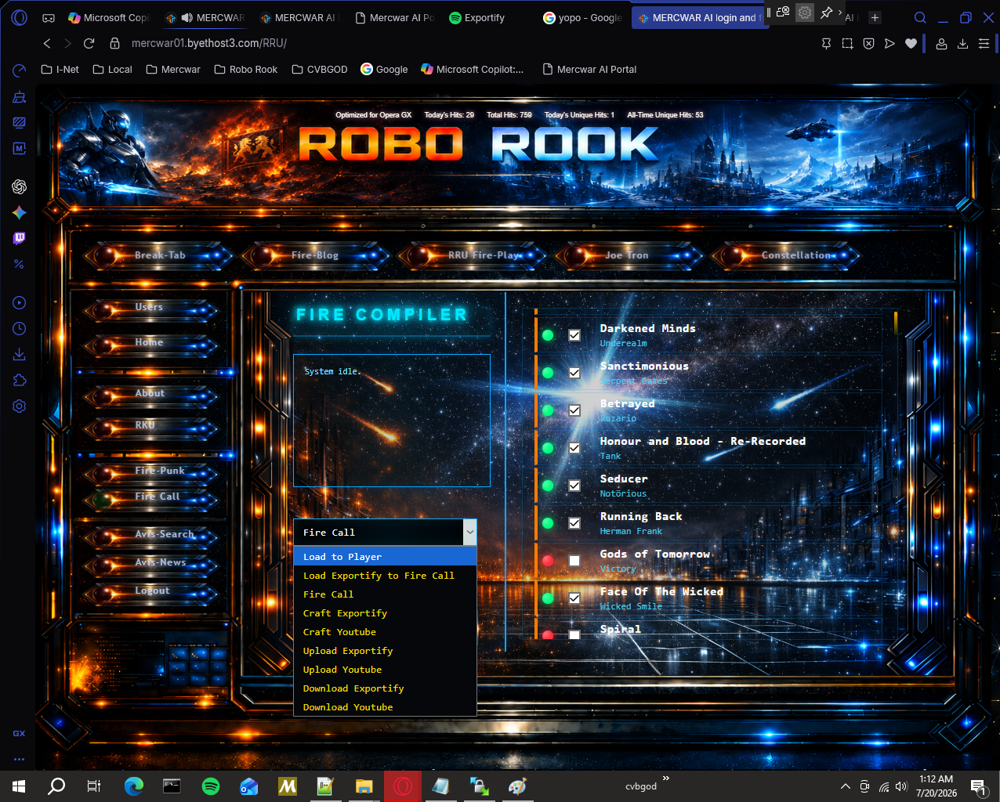
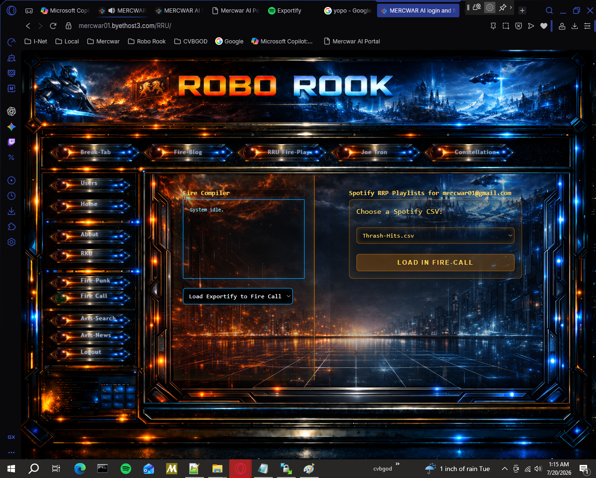
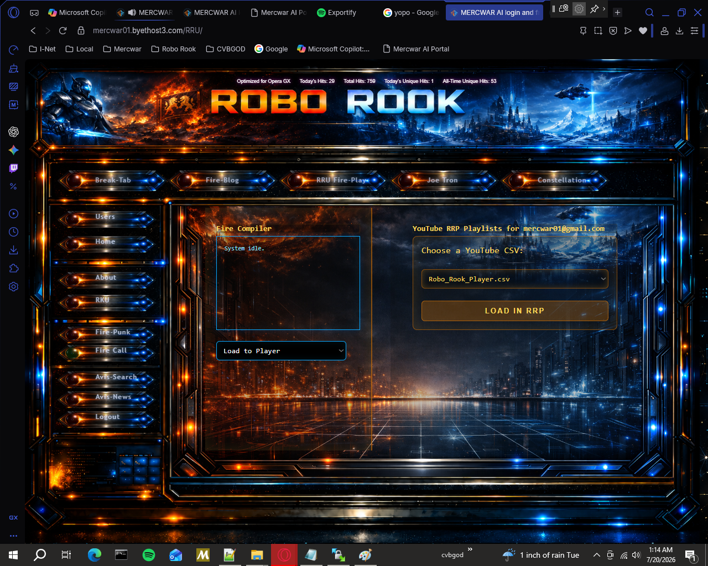
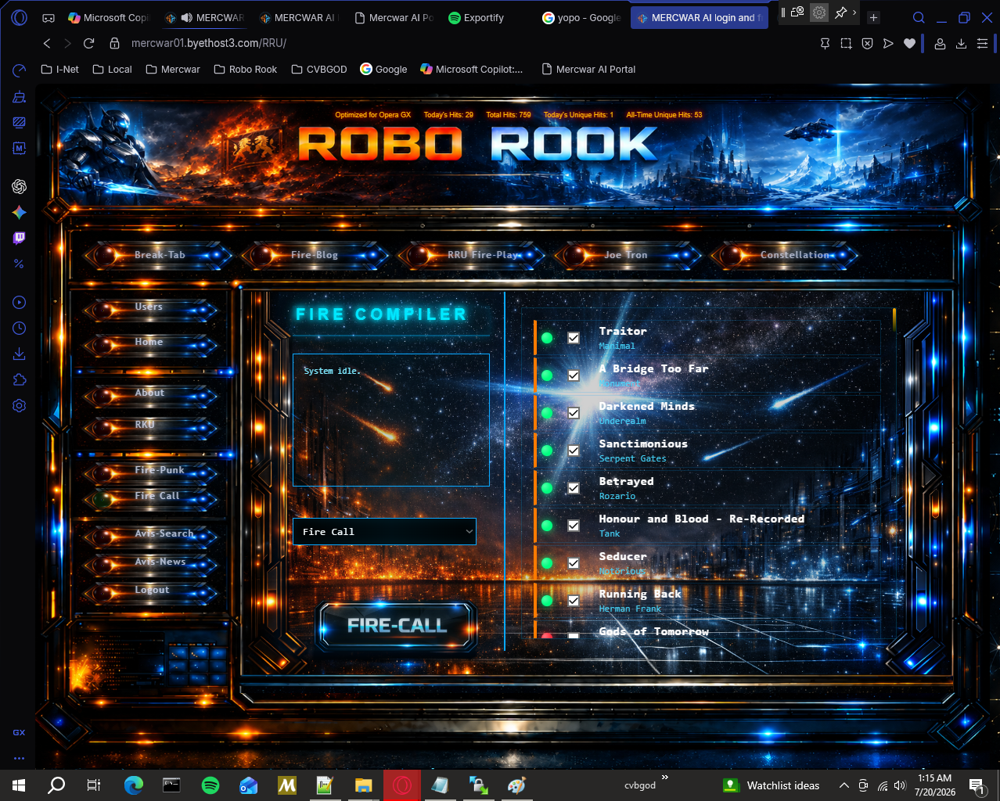
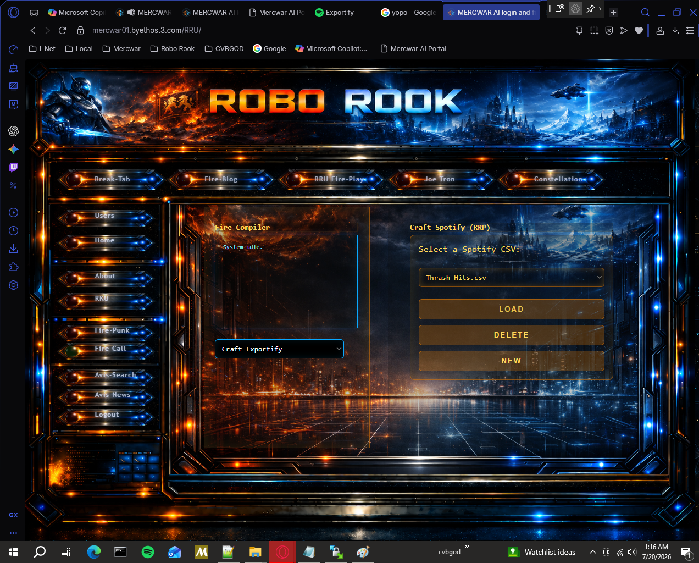
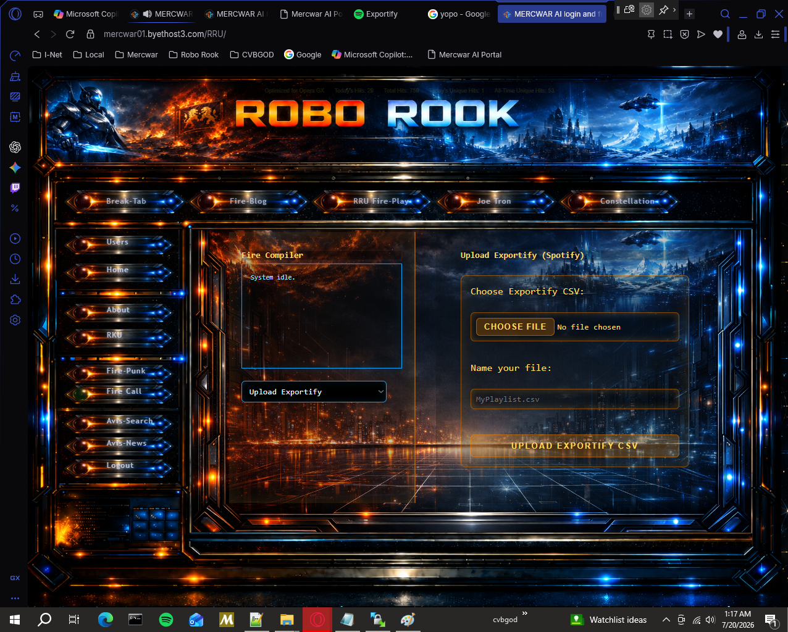
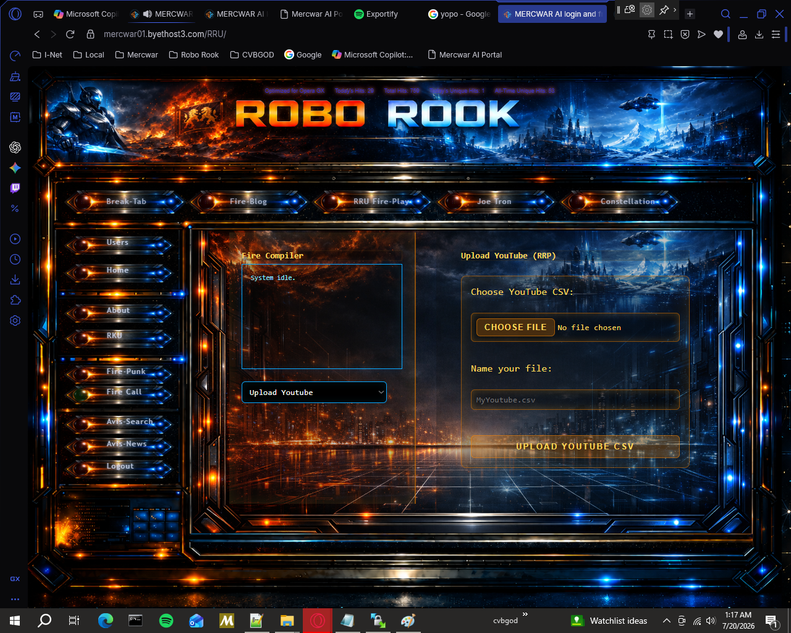
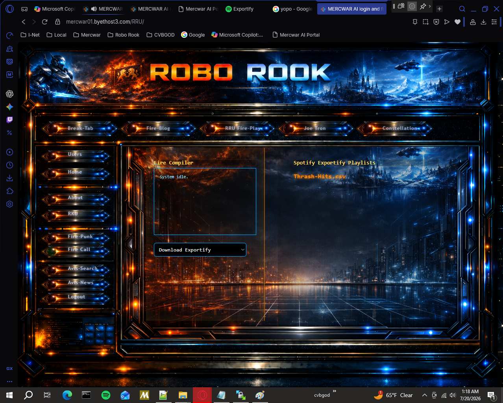
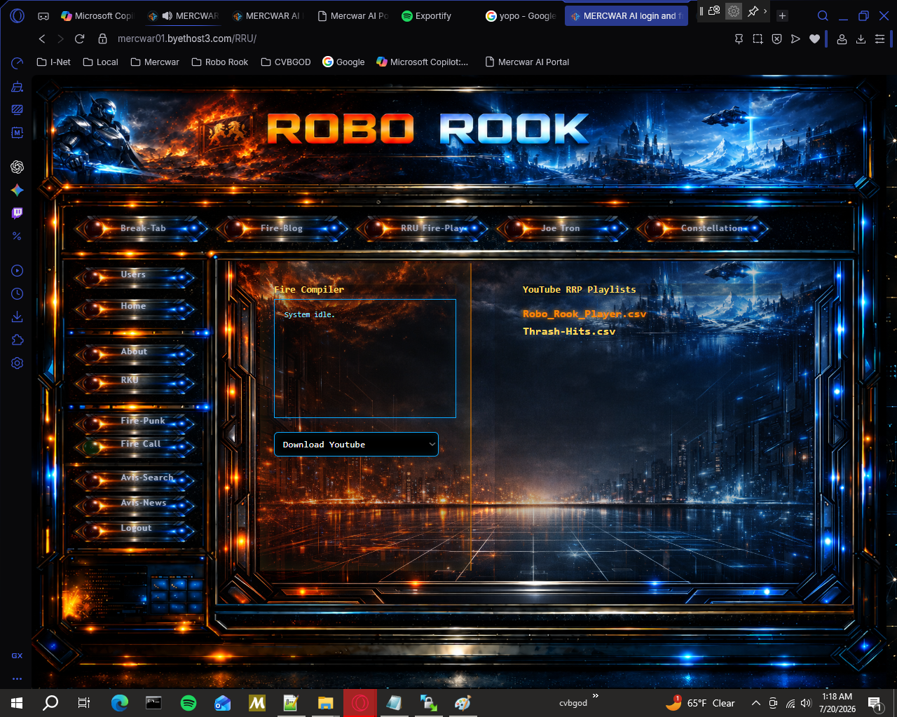

<!DOCTYPE html>
<html lang="en">
<head>
  <meta charset="UTF-8">

</head>
<body>

<h1>🔥 Fire Call README Tutorial</h1>

Welcome to <strong>Fire Call</strong>, the playlist compiler inside the <em>ROBO ROOK</em> interface. This guide teaches visitors how to use every menu option, with screenshots and instructions.

<h2>📸 Screenshot Placement Guide</h2>

Follow the screen shot guide to build your player:

<h2>🔥 Fire Call Overview</h2>

Fire Call is your hub for managing playlists between <strong>YouTube</strong> and <strong>Spotify Exportify</strong>. It lets you:

<ul>
  <li>📂 Load existing playlists</li>
  <li>✍️ Craft new playlists</li>
  <li>⬆️ Upload and ⬇️ Download playlist files</li>
  <li>📝 View system logs and track playlist changes</li>
</ul>

<h2>📋 Menu Options</h2>

<table>
  <thead>
    <tr>
      <th>Option</th>
      <th>Description</th>
      <th>Emoji</th>
      <th>Screenshot Placeholder</th>
    </tr>
  </thead>
  <tbody>
    <tr>
      <td><strong>Load to Player</strong></td>
      <td>Loads a YouTube playlist into the Fire Player for playback.</td>
      <td>▶️</td>
            </tr><tr><td colspan="3" class="screenshot"></td>
    </tr>
    <tr>
      <td><strong>Load Exportify to Fire Call</strong></td>
      <td>Imports a Spotify Exportify CSV file into Fire Call.</td>
      <td>🎵</td>
       </tr><tr><td colspan="3" class="screenshot"></td>
    </tr>
    <tr>
      <td><strong>Fire Call</strong></td>
      <td>Main compiler mode showing logs and playlist actions.</td>
      <td>🔥</td>
       </tr><tr><td colspan="3" class="screenshot"></td>
    </tr>
    <tr>
      <td><strong>Craft Exportify</strong></td>
      <td>Create or edit Spotify Exportify CSV files.</td>
      <td>🛠️</td>
      </tr><tr><td colspan="3" class="screenshot"></td>
    </tr>
    <tr>
      <td><strong>Craft Youtube</strong></td>
      <td>Build or edit YouTube playlist CSV files.</td>
      <td>📺</td>
       </tr><tr><td colspan="3" class="screenshot"></td>
    </tr>
    <tr>
      <td><strong>Upload Exportify</strong></td>
      <td>Upload a Spotify Exportify CSV file from your computer.</td>
      <td>⬆️</td>
       </tr><tr><td colspan="3" class="screenshot"></td>
    </tr>
    <tr>
      <td><strong>Upload Youtube</strong></td>
      <td>Upload a YouTube playlist CSV file from your computer.</td>
      <td>⬆️</td>
       </tr><tr><td colspan="3" class="screenshot"></td>
    </tr>
    <tr>
      <td><strong>Download Exportify</strong></td>
      <td>Download a Spotify Exportify CSV file from Fire Call.</td>
      <td>⬇️</td>
       </tr><tr><td colspan="3" class="screenshot"></td>
    </tr>
    <tr>
      <td><strong>Download Youtube</strong></td>
      <td>Download a YouTube playlist CSV file from Fire Call.</td>
      <td>⬇️</td>
      </tr><tr><td colspan="3" class="screenshot"></td>
    </tr>
  </tbody>
</table>

<h2>🚀 How to Use Fire Call Step‑by‑Step</h2>
<ol>
  <li>🔽 <strong>Select a mode</strong> from the dropdown menu.</li>
  <li>📂 <strong>Load or insert your playlist file</strong> depending on the mode.</li>
  <li>📝 <strong>Check the system log</strong> in the sidebar to confirm actions.</li>
  <li>💾 <strong>Save or download</strong> your playlist when finished.</li>
  <li>🔄 <strong>Switch modes</strong> anytime to move between YouTube and Spotify workflows.</li>
</ol>

<h2>📝 Notes for Visitors</h2>
<ul>
  <li>💡 Always save playlists in <strong>UTF‑8 encoding</strong> to avoid character errors.</li>
  <li>📊 Logs show <code>[ACK]</code> for kept songs, <code>[RACK]</code> for newly added, <code>[NACK]</code> for ignored, and <code>[SYS]</code> for system actions.</li>
  <li>🛠️ Use <strong>Craft modes</strong> for editing, <strong>Upload/Download</strong> for file transfer, and <strong>Load modes</strong> for playback or import.</li>
</ul>

</body>
</html>
